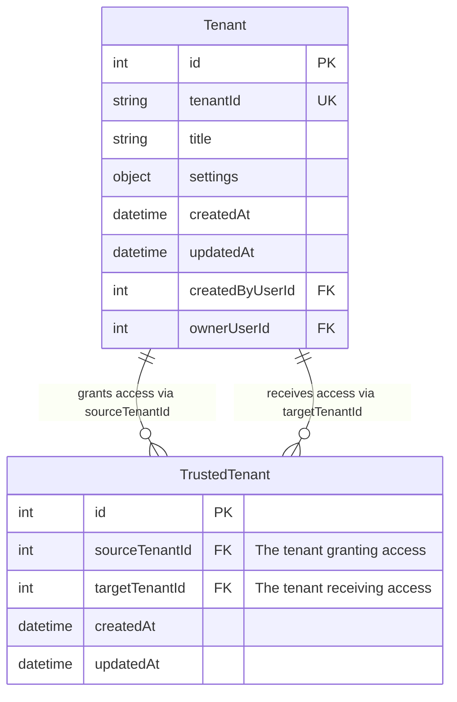
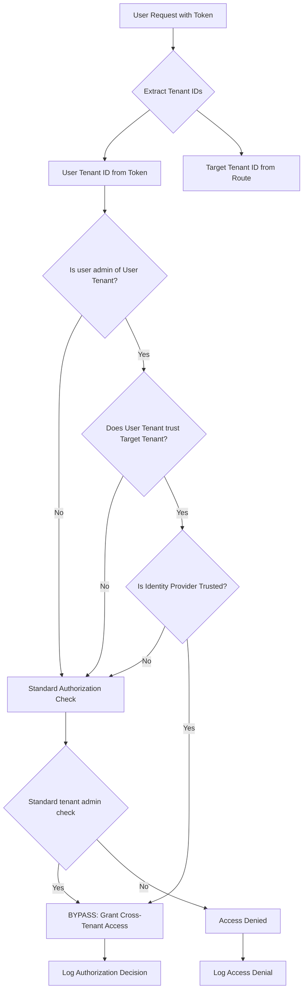
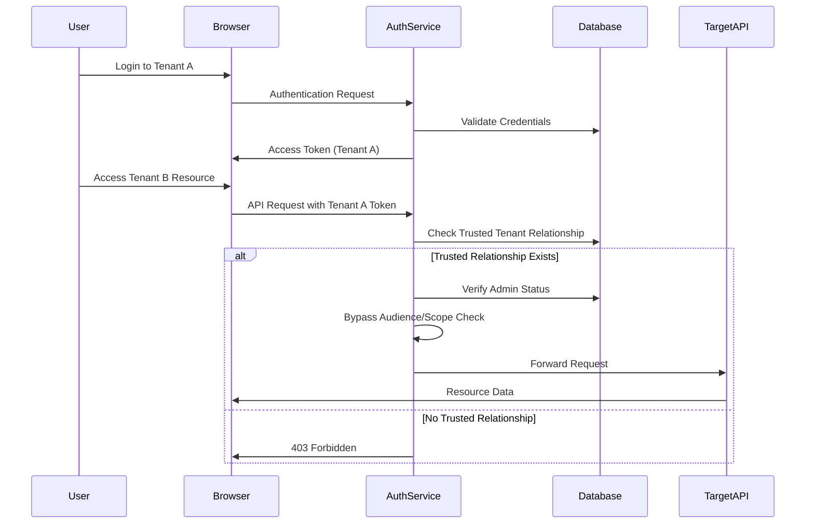
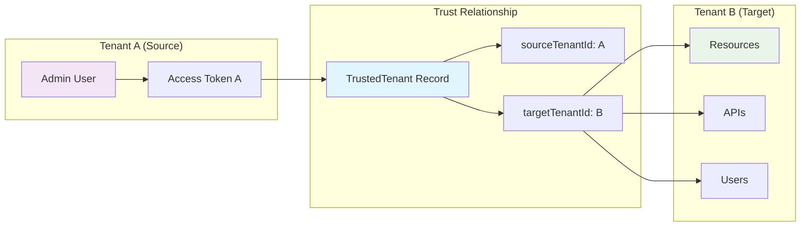
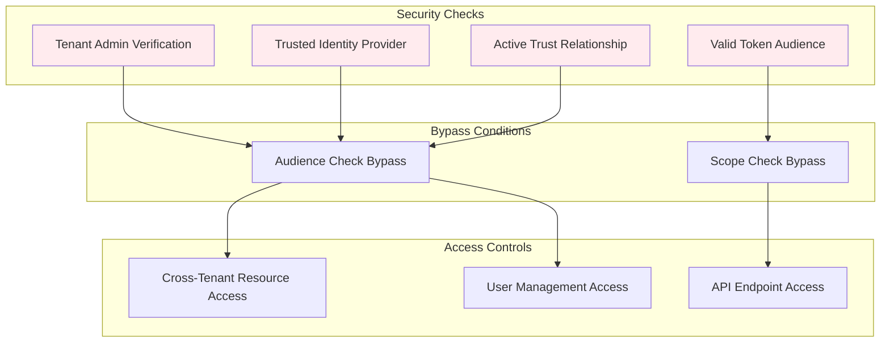

# Trusted Tenant Feature - Technical Implementation Guide

## Overview

The Trusted Tenant feature enables cross-tenant resource management without requiring separate authentication tokens or admin group membership. This feature allows tenant administrators to delegate management privileges to other tenants through a configurable trust relationship.

## Architecture

### Database Schema

The feature implements a many-to-many relationship through the `TrustedTenant` junction table:



**Key Constraints:**

- `sourceTenantId` and `targetTenantId` combination must be unique
- Both foreign keys have `ON DELETE CASCADE` behavior
- Self-referencing relationships are prevented (sourceTenantId ≠ targetTenantId)

### Data Models

```typescript
// Core junction table model
export class TrustedTenant extends Entity {
  @property({
    type: 'number',
    id: true,
    generated: true
  })
  id?: number;

  @belongsTo(() => Tenant, { keyTo: 'id', keyFrom: 'sourceTenantId' })
  sourceTenantId: number; // Trusting tenant

  @belongsTo(() => Tenant, { keyTo: 'id', keyFrom: 'targetTenantId' })
  targetTenantId: number; // Trusted tenant
}

// Tenant model integration
export class Tenant extends Entity {
  @hasMany(() => Tenant, {
    through: {
      model: () => TrustedTenant,
      keyFrom: 'sourceTenantId',
      keyTo: 'targetTenantId'
    }
  })
  trustedTenants: Tenant[];
}
```

## API Endpoints

### Management Endpoints

All endpoints are under `/auth/admin/tenants/{tenantId}`:

| Method   | Endpoint                          | Description                         |
| -------- | --------------------------------- | ----------------------------------- |
| `PUT`    | `/trust-tenant/{trustedTenantId}` | Establish trust relationship        |
| `DELETE` | `/trust-tenant/{trustedTenantId}` | Remove trust relationship           |
| `GET`    | `/manages-tenants`                | List tenants managed by this tenant |
| `GET`    | `/managed-by-tenants`             | List tenants managing this tenant   |

### Authorization Requirements

- **Tenant Admin privileges required** for the source tenant
- **Client Credentials tokens explicitly blocked**
- **Same tenant IDs rejected** (cannot trust self)

### Example Usage

```typescript
// Establish trust: Allow Tenant A admins to manage Tenant B
PUT / auth / admin / tenants / B / trust - tenant / A;
Authorization: Bearer <
  tenant - admin - token >
  // Remove trust relationship
  DELETE / auth / admin / tenants / B / trust - tenant / A;
Authorization: Bearer <
  tenant - admin - token >
  // List all tenants managed by Tenant A
  GET / auth / admin / tenants / A / manages - tenants;
Authorization: Bearer<token>;
```

## Authorization Logic

### Two-Tier Authorization Bypass

The feature implements authorization bypass at two critical middleware points:

#### 1. Audience Provider (Token Audience Validation)

```typescript
const trustedTenants = await this.tenantRepository
  .trustedTenants(tenantId)
  .find({
    where: { id: route.pathParams.tenantId }
  });

if (
  trustedTenants.length > 0 &&
  isTenantAdminOfOriginalAuthorizedTenant &&
  isIdentityProviderTrusted
) {
  this.logger.info(
    'AudienceProvider: allowed tenant administrator to bypass audience check using a Trusted Tenant',
    {
      /* detailed context */
    }
  );
  return null; // Bypasses audience requirement
}
```

#### 2. Authifi Middleware (Scope Validation)

```typescript
const trustedTenants = await this.tenantRepository
  .trustedTenants(userTenantId)
  .find({
    where: { id: tenantId },
    fields: { id: true }
  });

const isAuthorizedByTrustedTenant =
  isTenantAdminOfOriginalAuthorizedTenant && trustedTenants.length > 0;

if (isAuthorizedByTrustedTenant || isTenantAdminOfTargetTenant) {
  this.logger.info(
    'AuthMiddlewareProvider: Allowed admin user to bypass access token scope check',
    {
      /* authorization context */
    }
  );
  // Continue with request processing
}
```

### Authorization Decision Flow



## End-to-End System Impact

### Operational Workflow



### Cross-Tenant Access Flow



## Security Considerations

### Access Control Requirements

- **Admin Privileges**: Only tenant administrators can establish trust relationships
- **Identity Provider Validation**: Users must authenticate via trusted identity providers
- **Unidirectional Trust**: Trust relationships are one-way (A trusts B ≠ B trusts A)
- **Audit Logging**: All authorization decisions are logged with full context

### Security Boundaries



## Configuration

### Zero-Configuration Feature

The Trusted Tenant feature requires **no additional configuration**:

- **Database**: Automatically managed through migrations
- **Application**: Uses existing authentication infrastructure
- **Environment**: No environment variables required
- **Runtime**: Enabled by default with proper database schema

### Tenant-Level Settings

No specific tenant settings are required. The feature leverages:

```typescript
// Existing tenant admin group configuration
{
  "auth": {
    "defaults": {
      "adminGroup": {
        "name": "admins",
        "description": "Tenant administrator user group"
      }
    }
  }
}
```

## Integration Points

### Frontend Applications

**ng-auth (Authifi UI)**:

```typescript
// Token audience validation affects routing
checkUser(tenant: string, routeAfterLogin: string): Observable<boolean> {
  return this.authService.isAuthorized.pipe(
    map((isAuthorized: boolean): boolean => {
      const audience = `${this.authService.authConfig.url}/auth/${tenant}`;
      const tokenAudience = this.getTokenAudience();

      // Trusted tenant relationships allow cross-tenant access
      if (tokenAudience.includes(audience)) {
        return isAuthorized;
      }
      // ... additional logic
    })
  );
}
```

**auth-user-portal**:

- Cross-tenant user management without re-authentication
- Simplified admin workflows across multiple tenants

### Service Integration

**services-auth Package**:

```typescript
// Authentication provider integration
async action(request: RequestWithUser, response: Response): Promise<any> {
  // Leverages trusted tenant logic for audience validation
  const jwtAudience = (await this.audienceProvider()) || audience;

  const expressJwtMiddleware = expressjwt({
    audience: jwtAudience, // May be bypassed for trusted tenants
    // ... other configuration
  });
}
```

## Testing

### Integration Test Coverage

The feature includes comprehensive test scenarios covering:

- **Trust Establishment**: Verify admin users can establish trust relationships
- **Cross-Tenant Access**: Confirm trusted tenant authorization works
- **Access Denial**: Ensure non-trusted relationships are blocked
- **Error Handling**: Test invalid tenant IDs and unauthorized users
- **Trust Removal**: Verify access revocation when trust is removed

### Test Example

```typescript
it('allows cross-tenant resource management with trusted tenant relationship', async () => {
  // Create two tenants
  const rootTenant = await createTenant();
  const childTenant = await createTenant();

  // Create admin user in root tenant
  const adminUser = await createTenantAdmin(rootTenant.id);

  // Establish trust relationship
  await request
    .put(`/auth/admin/tenants/${childTenant.id}/trust-tenant/${rootTenant.id}`)
    .set('Authorization', `Bearer ${systemAdminToken}`)
    .expect(204);

  // Verify cross-tenant access works
  await expectAsync(
    createClient({
      request,
      token: adminUserToken, // Token for root tenant
      tenantId: childTenant.id // Accessing child tenant
    })
  ).toBeResolved();
});
```

## Limitations and Known Issues

### Explicit Limitations

- **Client Credentials Exclusion**: Service-to-service tokens cannot use trusted tenant features
- **Partial Endpoint Coverage**: Some Authifi endpoints may not recognize trusted tenant relationships
- **Identity Provider Dependency**: Requires authentication via trusted identity providers

### Architectural Constraints

- **Admin-Only Feature**: Limited to users with tenant administrator privileges
- **Unidirectional Trust**: Relationships are one-way only
- **Test Environment Bypass**: Special handling in test environments

### Performance Considerations

```typescript
// Optimized database queries for trust relationship checks
const trustedTenants = await this.tenantRepository
  .trustedTenants(userTenantId)
  .find({
    where: { id: tenantId },
    fields: { id: true } // Only fetch required fields
  });
```

## Monitoring and Observability

### Audit Logging

All trusted tenant authorization decisions generate structured log entries:

```typescript
this.logger.info(
  'AudienceProvider: allowed tenant administrator to bypass audience check using a Trusted Tenant',
  {
    authorizations: [
      `Tenant ID ${route.pathParams.tenantId} is trusted by tenant ID ${tenantId}`,
      `User is a tenant admin of ${tenantId}`,
      `User logged in with a trusted identity provider`
    ],
    routeParamsTenantId: route.pathParams.tenantId,
    userTenantId: tenantId,
    userId: payload.sub,
    clientId: payload.azp,
    issuerId: identityProvider?.issuerId,
    tags: [LOG_TAG.AUTHENTICATION]
  }
);
```

## Migration and Deployment

### Database Migration

The feature was introduced with migrations:

- `V20.11__create_trusted_tenant_table.sql`: Initial table creation
- `V20.12__fix_unique_constraint_trusted_tenant_table.sql`: Constraint optimization

### Backward Compatibility

The feature is fully backward compatible:

- **Existing authentication flows** continue unchanged
- **No configuration required** for deployment
- **Graceful degradation** if trusted relationships don't exist

## Related Documentation

- [Delegating Tenant Management to a Shared Tenant](delegating-tenant-management-to-a-shared-tenant.md) - User guide
- [Authorization](authorization.md) - General authorization concepts
