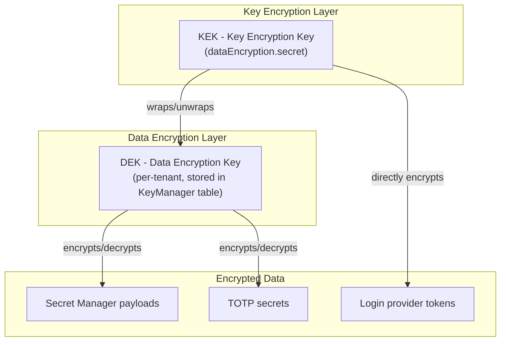
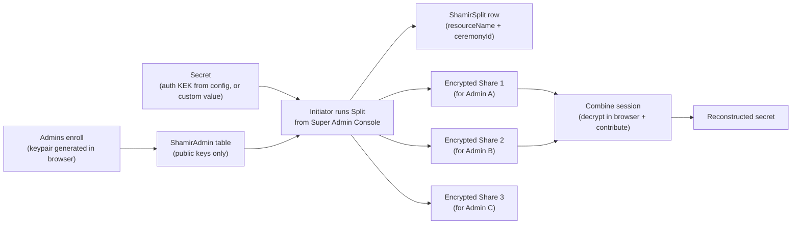
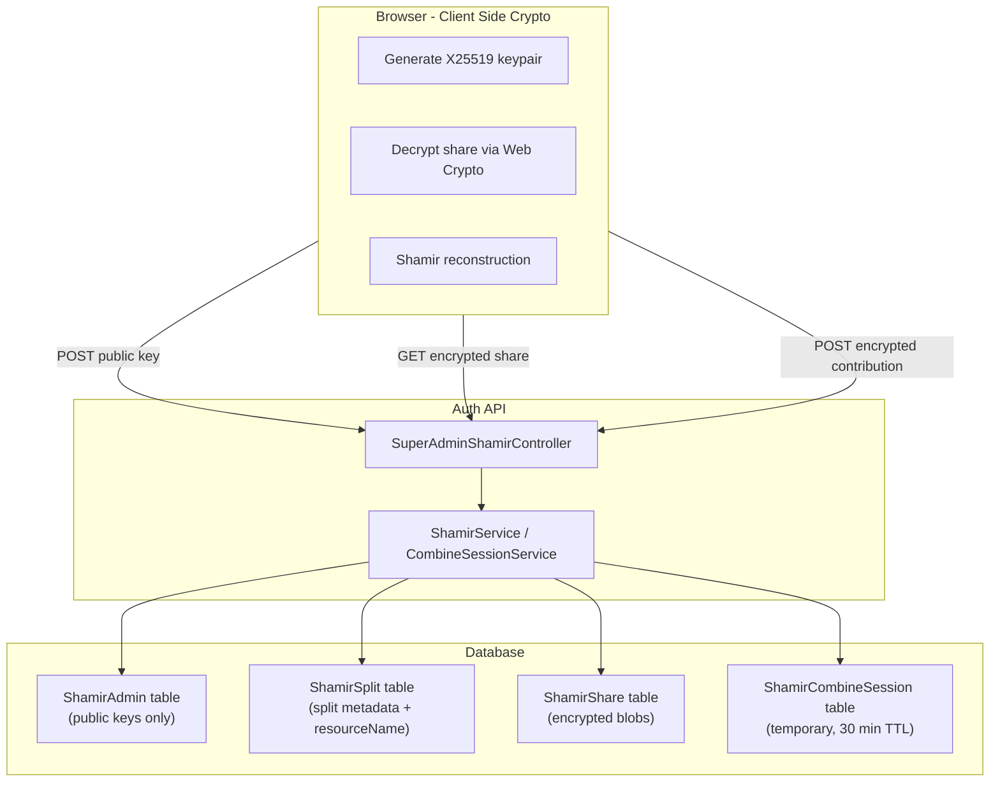

# Encryption Key Security and Backup

## Overview

Authifi uses a layered encryption architecture to protect sensitive data at rest. This document covers the encryption key hierarchy, the security mechanisms in place, and the backup/recovery procedures for key material.

---

## Encryption Architecture

### Key Hierarchy

Authifi uses **envelope encryption** -- a pattern where data is encrypted with one key (DEK), and that key is itself encrypted with another key (KEK).

### Key Types

| Key                               | What it is                                     | Where it lives                        | What it protects                                           |
| --------------------------------- | ---------------------------------------------- | ------------------------------------- | ---------------------------------------------------------- |
| **KEK** (`dataEncryption.secret`) | A static master secret from application config | Config file or environment variable   | Wraps DEKs; directly encrypts `UserLoginProviderTokenData` |
| **DEK** (`KeyManager.key`)        | A random 256-bit key, one per tenant/ownership | `KeyManager` database table (wrapped) | Encrypts secret manager payloads and TOTP secrets          |

### Why Two Layers?

- **Database compromise alone is not enough.** Even if an attacker gets the full database, the DEKs are wrapped (encrypted) and useless without the KEK.
- **Key rotation is simpler.** You can rotate the KEK (re-wrap all DEKs) without re-encrypting every piece of data. You can rotate a DEK without touching the KEK.
- **Different protection per environment.** The KEK can be protected differently depending on the deployment (local wrapping, Vault Transit, cloud KMS).

---

## KEK Providers

Authifi supports multiple strategies for protecting DEKs at rest, configured via `dataEncryption.kekProvider` in the application config.

### Provider: `none` (default)

DEKs are stored as plaintext in the database. This is the legacy mode.

- **Security**: Low -- database access exposes all DEKs
- **Use case**: Development, testing
- **Config**: `dataEncryption.kekProvider: 'none'`

### Provider: `local`

DEKs are encrypted using the `dataEncryption.secret` via `SecureCrypto` (AES-256-CBC + scrypt key derivation + HMAC authentication).

- **Security**: Medium -- database compromise alone does not expose DEKs. Security depends on how well the `dataEncryption.secret` is protected.
- **Use case**: Any environment, especially those without HashiCorp Vault
- **Config**: `dataEncryption.kekProvider: 'local'`
- **Requirements**: `dataEncryption.secret` must be at least 32 characters

The local provider stores wrapped DEKs with the encoding tag `local_wrapped_v1` in the `KeyManager.keyEncoding` column.

### Provider: `vault-transit`

DEKs are encrypted using HashiCorp Vault's Transit secrets engine. The KEK never leaves Vault.

- **Security**: High -- DEKs in the database are useless without Vault access. Vault manages the KEK lifecycle, rotation, and provides audit logging.
- **Use case**: Production environments with HashiCorp Vault deployed
- **Config**: `dataEncryption.kekProvider: 'vault-transit'`
- **Requirements**: `vault.enabled: true`, Transit engine mounted and configured

The Transit provider stores wrapped DEKs with the encoding tag `vault_transit_v1` in the `KeyManager.keyEncoding` column.

### Provider Comparison

| Aspect                      | `none` | `local`          | `vault-transit`                    |
| --------------------------- | ------ | ---------------- | ---------------------------------- |
| DB compromise exposes DEKs  | Yes    | No               | No                                 |
| External dependency         | None   | None             | Vault                              |
| KEK rotation                | N/A    | Re-wrap all DEKs | `transit/rewrap` (non-destructive) |
| Hardware-backed protection  | No     | No               | Optional (Vault HSM)               |
| Audit logging of key access | No     | No               | Yes (Vault audit)                  |
| Recommended for production  | No     | Acceptable       | Preferred                          |

---

## Cryptographic Details

### SecureCrypto (used by local KEK provider)

The `SecureCrypto` utility provides authenticated encryption:

- **Algorithm**: AES-256-CBC
- **Key derivation**: scrypt (N=16384, r=8, p=1) -- memory-hard, resistant to brute force
- **Integrity**: HMAC-SHA256 (Encrypt-then-MAC)
- **Salt**: 32 bytes, randomly generated per encryption
- **IV**: 16 bytes, randomly generated per encryption

Each encryption produces a unique ciphertext even for the same plaintext, due to random salt and IV.

### DEK Generation

DEKs are generated using `crypto.randomBytes(32)` (256-bit) when the KEK provider is enabled, or `nanoid` (32 characters) in legacy mode.

---

## Migration Services

### Backfill Service (plaintext to wrapped)

The `LocalKekWrapBackfillService` migrates existing plaintext DEKs (`db_stored_v1`) to locally wrapped format (`local_wrapped_v1`).

- Processes all `KeyManager` rows with `keyEncoding = 'db_stored_v1'` or `NULL`
- Supports dry-run mode to preview changes without modifying data
- Wraps each DEK with the configured `dataEncryption.secret`
- Updates `keyEncoding` to `local_wrapped_v1`

### Unwrap Service (wrapped to plaintext)

The `LocalKekUnwrapService` reverses local wrapping, converting `local_wrapped_v1` DEKs back to `db_stored_v1`.

- Used for rollback scenarios or migration to a different KEK provider
- Supports dry-run mode

---

## Backup and Recovery

### What Needs to Be Backed Up

| Item                       | Why                                         | Impact if lost                                                                        |
| -------------------------- | ------------------------------------------- | ------------------------------------------------------------------------------------- |
| `dataEncryption.secret`    | KEK for local wrapping and token encryption | All DEKs become undecryptable; all login provider tokens lost                         |
| `KeyManager` table         | Contains wrapped DEKs                       | Secrets and TOTP codes become inaccessible (even with KEK, you need the wrapped DEKs) |
| Vault unseal/recovery keys | Required to unseal Vault after restart      | Vault becomes permanently sealed; Transit-wrapped DEKs are inaccessible               |
| Vault snapshots            | Vault data including Transit keys           | Same as losing unseal keys if Vault storage is lost                                   |

### Shamir Key Management (Super Admin Console)

Authifi provides a web-based Shamir's Secret Sharing implementation for backing up and recovering secrets. It is built into the **Super Admin Console** under **Key Management**, and requires no command-line tooling.

Although it was originally built to protect the `dataEncryption.secret` (KEK), it is now a **general-purpose secret-splitting tool**: any sensitive value (a custom secret, an API key, a recovery passphrase, etc.) can be split, distributed to custodians, and later reconstructed. Each split is associated with a **resource name** that identifies what was split.

- **Reserved resource** `auth-data-encryption-secret` -- this is the auth KEK. Its value is read directly from `dataEncryption.secret` in the server config; it is never typed into the UI or displayed during a split.
- **Custom resources** -- any other resource name. The initiator supplies both a name (letters, numbers, dots, underscores, dashes; up to 255 chars) and the secret value to split.

Only **one active split per resource name** is kept. Re-splitting the same resource deletes the previous split and all of its shares before creating the new one.

#### How Shamir's Secret Sharing Works

Shamir's Secret Sharing splits a secret into N shares, where any M shares (the threshold) can reconstruct the original, but fewer than M shares reveal nothing about the secret.

#### Architecture

All sensitive cryptographic operations (keypair generation, share decryption, secret reconstruction) happen **client-side in the browser** using the Web Crypto API. The server only ever sees public keys, encrypted blobs, and non-sensitive metadata (resource names, thresholds, timestamps).

#### Database Tables

| Table                  | Holds                                                                                                                       | Sensitive?                             |
| ---------------------- | --------------------------------------------------------------------------------------------------------------------------- | -------------------------------------- |
| `ShamirAdmin`          | One row per enrolled admin: their public key and display name                                                               | No -- public keys only                 |
| `ShamirSplit`          | One row per active split: `ceremonyId`, `resourceName`, initiator, threshold, total shares, timestamp                       | No -- metadata only                    |
| `ShamirShare`          | One encrypted share per admin per split (`ceremonyId` + `adminId`)                                                          | Encrypted blob (X25519 + AES-256-GCM)  |
| `ShamirCombineSession` | One row per combine session: `sessionId`, linked `ceremonyId`, ephemeral public key, encrypted contributions, 30-min expiry | Encrypted blobs + ephemeral public key |

#### Dashboard (`/key-management`)

The Key Management dashboard is the landing page and surfaces everything at a glance:

- **Active Combine Sessions** -- in-progress recovery sessions (session ID, initiator, resource, progress toward threshold, expiry). An admin who was told "I started a session, please contribute" can find it here and join directly.
- **Enrolled Admins** -- the list of custodians and their public keys. The **Rotate Key** action lives in this card header for re-enrollment (see below).
- **Split History** -- every split that has been run (resource, initiator, threshold/total, status, timestamp).
- **Combine History** -- every combine session that has been run (resource, initiator, status, timestamp).

The **Enroll** action is shown in the page header and is disabled once the current admin is already enrolled.

#### Web UI Workflow

**1. Enroll** (`/key-management/enroll`)

1. Admin clicks "Generate Keypair" -- an X25519 keypair is generated in the browser
2. Admin downloads the private key as a `.pem` file (must be stored securely, e.g. in a password manager)
3. Admin registers their public key with the server
4. The private key never leaves the browser; the server only stores the public key in the `ShamirAdmin` table

**2. Split Secret** (`/key-management/split`)

1. The initiator chooses the source:
  - **Auth service data-encryption secret** -- the server reads `dataEncryption.secret` from config. The value is never typed or displayed.
  - **Custom secret** -- the initiator enters a resource name and the secret value to split.
2. The initiator sets the threshold (M); total shares (N) equals the number of enrolled admins.
3. On split, the server splits the secret using Shamir's algorithm, encrypts each share with the corresponding admin's public key, records the split metadata in `ShamirSplit`, and stores the encrypted shares in `ShamirShare`. Any previous active split for the same resource is deleted first.

**3. Combine** (`/key-management/combine`)

The combine screen handles share decryption inline -- there is no separate "My Share" page. An admin chooses a role from a dialog: **Start a session** (initiator) or **Join a session** (contributor).

*Initiator:*

1. Picks **which secret to recover** from a dropdown of existing splits. The threshold is taken from that split -- it is not re-entered.
2. Starts the session -- the server generates an ephemeral X25519 keypair scoped to the session (linked to the split's `ceremonyId`) and returns its public key.
3. Receives a session ID (kept visible on screen for sharing), then provides their own private key. After acknowledging a short disclaimer, the browser decrypts the admin's own share locally, re-encrypts it with the session's ephemeral public key, and submits it.
4. Waits for other admins to contribute. When the threshold is met, the browser fetches all encrypted contributions plus the session's ephemeral private key, decrypts them client-side, and reconstructs the secret entirely in the browser. The result is hidden behind a **Reveal Secret** button so it isn't shown until the initiator is ready.

*Contributor:*

1. Opens the link from the email (session ID pre-filled) or pastes the session ID and clicks **Look up**. The screen shows which resource is being recovered.
2. Provides their private key. After acknowledging the disclaimer, the browser decrypts their share locally, encrypts it with the session's ephemeral public key, and posts it.
3. The contribution is stored as an opaque encrypted blob; only the initiator's browser can decrypt it.

The private key input is **masked by default** (with a show/hide toggle) and can be pasted or loaded from a `.pem` file. The private key is processed locally and never sent to the server.

#### Key Rotation / Re-enrollment

An already-enrolled admin can **Rotate Key** from the Enrolled Admins card. This generates a brand-new keypair and replaces their stored public key.

> **Warning:** Rotating a key deletes all existing shares that were encrypted for the old key. Any split those shares belonged to can no longer be completed by that admin until a fresh split is run. The UI requires an explicit acknowledgement before proceeding.

#### Email Notifications

The auth service sends email notifications at the key points in the workflow so all enrolled admins stay informed:

| Event                   | Trigger                               | Recipients               | Purpose                                                                                                        |
| ----------------------- | ------------------------------------- | ------------------------ | -------------------------------------------------------------------------------------------------------------- |
| Enrollment confirmation | Admin successfully enrolls            | The newly enrolled admin | Confirm enrollment, remind to safeguard the private key                                                        |
| Split completed         | A split finishes                      | All enrolled admins      | Notify each admin that an encrypted share has been generated for them (includes the resource name)             |
| Combine session started | An initiator starts a combine session | All enrolled admins      | Notify admins that a recovery is in progress (includes resource name + ceremony ID) and ask them to contribute |

The combine notification includes a direct link with the session ID pre-filled, so contributors land on the Combine screen with the session already loaded -- they only need to provide their private key and submit.

Notifications are sent asynchronously (fire-and-forget); failures to send do not block the underlying operation. The link target is configured via `auth.superAdminUi.baseUrl`.

#### Recommended Configuration

| Scenario                  | Shares (N) | Threshold (M) | Rationale                                          |
| ------------------------- | ---------- | ------------- | -------------------------------------------------- |
| Small team (3-5 admins)   | 5          | 2             | Any 2 admins can recover; tolerates 3 unavailable  |
| Medium team (5-10 admins) | 5          | 3             | Stronger protection; still tolerates 2 unavailable |
| High security             | 7          | 4             | Majority required; tolerates 3 unavailable         |

#### Key Ceremony Procedure

1. **Enrollment**: Each custodian logs into the Super Admin Console, navigates to **Key Management → Enroll**, generates their keypair in the browser, downloads their private key file, and registers their public key. They store the private key in a password manager.
2. **Split**: A super admin runs the split from **Key Management → Split Secret**, choosing the auth KEK (read from config) or a custom secret. The split and its metadata are recorded so the team can see it in **Split History**.
3. **Notification**: Each admin automatically receives an email letting them know a share is ready, including the resource name.
4. **Custody**: Each custodian keeps their downloaded private key file safe. Encrypted shares stay on the server until a combine session is run.

#### Reconstructing a Secret (Combine Session)

When a secret needs to be reconstructed (e.g. disaster recovery):

1. **Initiator** opens **Key Management → Combine**, picks the secret to recover from the split dropdown, and starts a session. They provide their private key; the browser decrypts their share and submits it (encrypted to the session) after they acknowledge the disclaimer.
2. **Contributors** receive an email with a direct link to the session (or look it up by session ID). They provide their private key; the browser decrypts their share and submits it (also encrypted to the session).
3. Once the threshold is reached, the initiator's browser pulls the encrypted contributions plus the session's ephemeral private key, decrypts each contribution, and reconstructs the secret in the browser. The initiator clicks **Reveal Secret** to display it.

The reconstructed secret is displayed only to the initiator and is never persisted server-side. Combine sessions expire 30 minutes after creation.

**Security properties of the web UI:**

- Private keys are generated in the browser and never leave the browser; the combine input is masked by default
- Share decryption and secret reconstruction happen client-side via the Web Crypto API
- The server stores only public keys (in `ShamirAdmin`), split metadata (in `ShamirSplit`), and encrypted blobs (in `ShamirShare`, `ShamirCombineSession`)
- Combine sessions use ephemeral X25519 keys held only in server process memory and expire after 30 minutes
- Each share and contribution is encrypted via X25519 + AES-256-GCM before transmission/storage
- All endpoints are gated by super admin authentication

#### When to Re-split

- When a custodian leaves the organization
- When a custodian's share may have been compromised
- When a custodian rotates their key (their old shares are deleted)
- After rotating the `dataEncryption.secret` or changing a custom secret's value
- Periodically (e.g., annually) as a security hygiene practice

